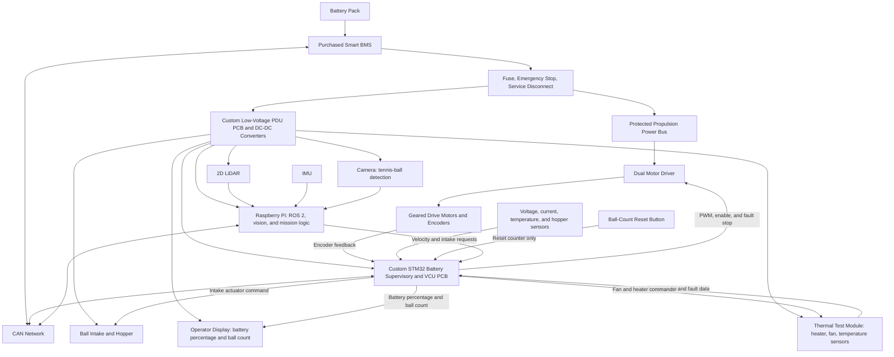

# System Architecture

The tennis-ball collector separates cell protection, real-time vehicle control, and high-level autonomy. Power flows from the protected battery system to the drivetrain and low-voltage electronics. The CAN network exchanges vehicle-status data between the BMS, STM32 VCU, and Raspberry Pi.

## Interface Summary

| Interface | Information or power carried |
|---|---|
| Battery to BMS to safety hardware | Protected propulsion power |
| Safety hardware to custom low-voltage PDU PCB | Protected input power, conversion, and fused logic-power distribution |
| BMS, STM32 VCU, and Raspberry Pi | CAN battery status, faults, motor state, mission state, and telemetry |
| Raspberry Pi to STM32 VCU | High-level velocity, collection, and intake requests |
| STM32 VCU to motor driver | PWM, direction/enable, and safety stop commands |
| STM32 VCU to operator display | BMS-derived battery percentage and ball-count value |
| Reset button to STM32 VCU | Command to reset the ball-count value only |
| Camera to Raspberry Pi | Image data for tennis-ball detection |
| LiDAR and IMU to Raspberry Pi | Localization, obstacle sensing, and navigation data |
| Encoder, electrical, thermal, and hopper sensors to STM32 VCU | Real-time feedback and fault detection |

## Safety Responsibility

| Layer | Responsibility |
|---|---|
| Smart BMS | Independent cell protection, current protection, temperature protection, and balancing |
| Custom Battery Supervisory/VCU PCB | Rover-level derating, motor disable, intake disable, sensor validation, BMS/CAN interface, and fault logging |
| Custom low-voltage PDU PCB | Fused, regulated low-voltage distribution; it does not replace propulsion safety hardware |
| Operator display and reset button | Operator information and ball-count reset only; no control over BMS or rover safety states |
| Raspberry Pi | Mission planning and collection decisions; it does not override BMS protection or low-level fault stops |
